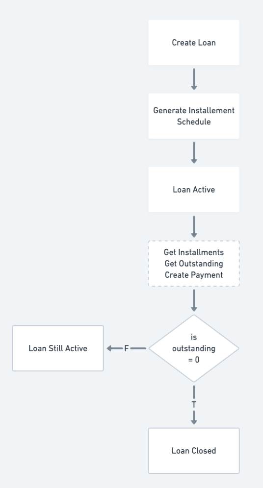
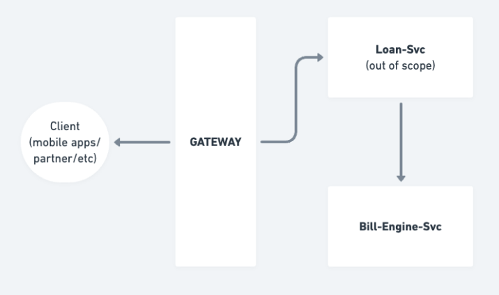
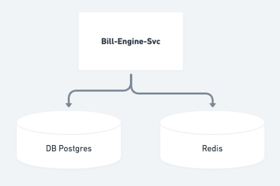
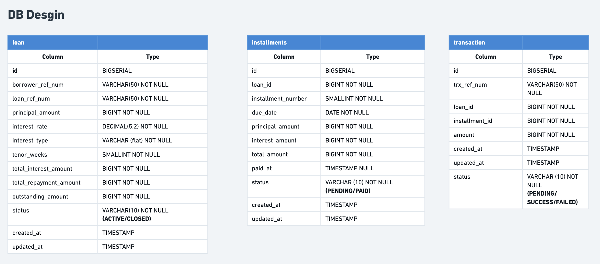

# Billing Engine Service

Billing service engine to handle schedule of installments.

## How to run the service

### Prerequisites
Before running the service, ensure you have the following installed:
- **Go**: Version 1.21 or higher.
- **Docker**: For containerized execution.
- **Database**: PostgreSQL (or the DB configured in your `.env`).
- **Redis**: For caching (or the Redis configured in your `.env`).

### Running with Bash Script (Recommended)
1. Make sure you have PostgreSQL running and your `.env` file is configured.
2. Run the script:
   ```bash
   ./run.sh
   ```

### Running Manually
1.  Ensure you have [Go](https://golang.org/doc/install) installed (version 1.21+ recommended).
2.  Ensure you have [PostgreSQL](https://www.postgresql.org/download/) installed and running.
3.  Ensure you have [Redis](https://redis.io/download/) installed and running.
4.  **Create the database** if it doesn't already exist:
    ```bash
    psql -h localhost -U postgres -c "CREATE DATABASE billenginedb"
    ```
5.  Clone the repository and navigate to the project root.
6.  Install dependencies:
    ```bash
    go mod tidy
    ```
7.  Setup your environment variables in a `.env` file.
8.  Run the application:
    ```bash
    go run main.go
    ```

### Running with Docker Compose
1. Ensure you have [Docker](https://docs.docker.com/get-docker/) and [Docker Compose](https://docs.docker.com/compose/install/) installed.
2. Build and start the containers:
    ```bash
    docker-compose up -d --build
    ```
3. The service will be available at `http://localhost:8082`.
4. To stop the containers:
    ```bash
    docker-compose down
    ```
---

## System Design

### 1. Requirement

#### a. Functional Requirement
- **Loan Schedule Generation**:
    - generates a weekly installment schedule upon loan creation.
- **Outstanding Calculation**:
    - calculates of outstanding on a loan and due date.
- **Delinquent Detection**:
    - detects borrowers with more than 2 weeks of Non payment of the loan amount.
- **Create Payment**:
    - process installment payments and update loan status.
    - borrower can only pay the
exact amount of payable that week or not pay at all
- **Catch up payment for missed weeks**:
    - allows borrowers to pay missed payment.

#### b. Non-Functional Requirement
- **Maintainability**:
    - Built using Clean Architecture for clear separation of concerns.
- **Reliability**
    - Handles race conditions in payment transactions.
    - Ensures idempotent payment processing to prevent duplicate transactions.
- **Observability**
    - Implements structured logging for tracking service operations.

### 2. Architecture
The service follows **Clean Architecture** patterns:
- **Handlers**: Drive the API layer (Gin Gonic).
- **Services**: Contain the core business logic.
- **Repositories**: Handle data persistence (GORM).
- **Entities**: Define the core domain models.

#### Project Structure
```text
.
├── internal/
│   ├── dto/            # Data Transfer Objects for API requests/responses
│   ├── entity/         # Database models and domain entities
│   ├── handlers/       # HTTP handlers (Gin Gonic)
│   ├── repositories/   # Data access layer (GORM)
│   ├── services/       # Core business logic
│   └── shared/         # Shared utilities (config, database, constant, logger)
├── main.go             # Application entry point
└── README.md           # Documentation
```

#### High Level Flow


#### High Level Architecture


#### Bill Engine Service Architecture


URL: [\[High Level Flow & Architecture\]](https://whimsical.com/flow-SjJbuFRC3k4W65SLDZVHJ2)

### 3. Database Design
The system uses a relational database with the following core entities:
- **Loans**: Stores loan metadata, interest rates, and total amounts.
- **Installments**: Stores individual weekly payment schedules.
- **Transactions**: Tracks payment history.


URL: [\[Database Design\]](https://whimsical.com/database-DZ5Qiz8pmnRFUonXK5wMTC)

### 4. API Design

| Method | Endpoint | Description |
| :--- | :--- | :--- |
| `GET` | `/health` | Service health check |
| `POST` | `/api/v1/loans` | Create a new loan and generate installments |
| `GET` | `/api/v1/loans/:loan_ref_num/installments` | Get installment schedule for a loan |
| `GET` | `/api/v1/loans/:loan_ref_num/outstanding` | Get current outstanding amount |
| `GET` | `/api/v1/loans/:loan_ref_num/delinquent` | Check if a borrower is delinquent |
| `POST` | `/api/v1/loans/payment` | Make a payment towards installments |

#### Request/Response Examples

**1. Health Check**
- **Endpoint**: `GET /health`
- **Response**:
```json
{
    "code": "00",
    "message": "Billing Service is running.",
    "data": null
}
```

**2. Create Loan**
- **Endpoint**: `POST /api/v1/loans`
- **Request**:
```json
{
  "borrower_ref_num": "B0001",
  "principal_amount": 3000000
}
```
- **Response**:
```json
{
    "code": "00",
    "message": "Success",
    "data": {
        "loan_ref_num": "LN-01032026-868624193",
        "principal_amount": 3000000,
        "total_interest_amount": 300000,
        "total_repayment_amount": 3300000,
        "weekly_installment": 1100000,
        "status": "ACTIVE"
    }
}
```

**3. Get Installment Schedule**
- **Endpoint**: `GET /api/v1/loans/:loan_ref_num/installments`
- **Response**:
```json
{
    "code": "00",
    "message": "Success",
    "data": {
        "loan_ref_num": "LN-01032026-868624193",
        "total_installments": 3,
        "installments": [
            {
                "installment_number": 1,
                "principal_amount": 1000000,
                "interest_amount": 100000,
                "total_amount": 1100000,
                "due_date": "2026-02-15T00:00:00Z",
                "status": "OVERDUE",
                "paid_at": null
            },
            {
                "installment_number": 2,
                "principal_amount": 1000000,
                "interest_amount": 100000,
                "total_amount": 1100000,
                "due_date": "2026-02-15T00:00:00Z",
                "status": "OVERDUE",
                "paid_at": null
            },
            {
                "installment_number": 3,
                "principal_amount": 1000000,
                "interest_amount": 100000,
                "total_amount": 1100000,
                "due_date": "2026-03-22T00:00:00Z",
                "status": "PENDING",
                "paid_at": null
            }
        ],
        "summary": {
            "total_outstanding": 3300000,
            "is_delinquent": true
        }
    }
}
```

**4. Get Outstanding**
- **Endpoint**: `GET /api/v1/loans/:loan_ref_num/outstanding`
- **Response**:
```json
{
    "code": "00",
    "message": "Success",
    "data": {
        "loan_ref_num": "LN-01032026-868624193",
        "outstanding_amount": 3300000
    }
}
```

**5. Check Delinquent**
- **Endpoint**: `GET /api/v1/loans/:loan_ref_num/delinquent`
- **Response**:
```json
{
    "code": "00",
    "message": "Success",
    "data": {
        "loan_ref_num": "LN-01032026-868624193",
        "is_delinquent": true
    }
}
```

**6. Pay Installment**
- **Endpoint**: `POST /api/v1/loans/payment`
- **Request**:
```json
{
  "loan_ref_num": "LN-01032026-868624193",
  "amount": 3300000
}
```
- **Response**:
```json
{
  "code": "00",
  "message": "success",
  "data": {
    "loan_ref_number": "LN-01032026-868624193",
    "trx_ref_num": "TX0001",
    "paid_amount": 3300000,
    "paid_installments": [
      1,
      2,
      3
    ],
    "remaining_outstanding": 0,
    "paid_at": "2026-03-01T21:51:52+07:00"
  }
}
```
